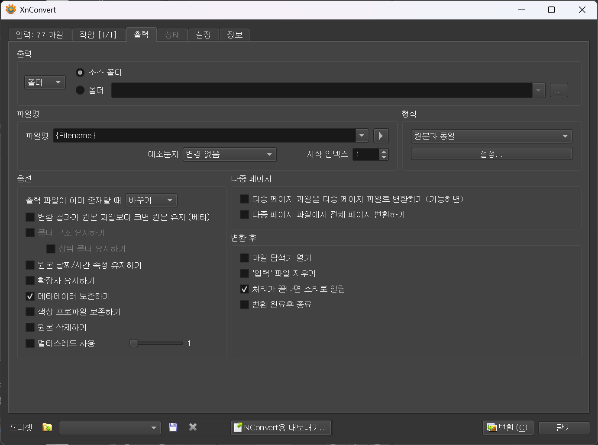
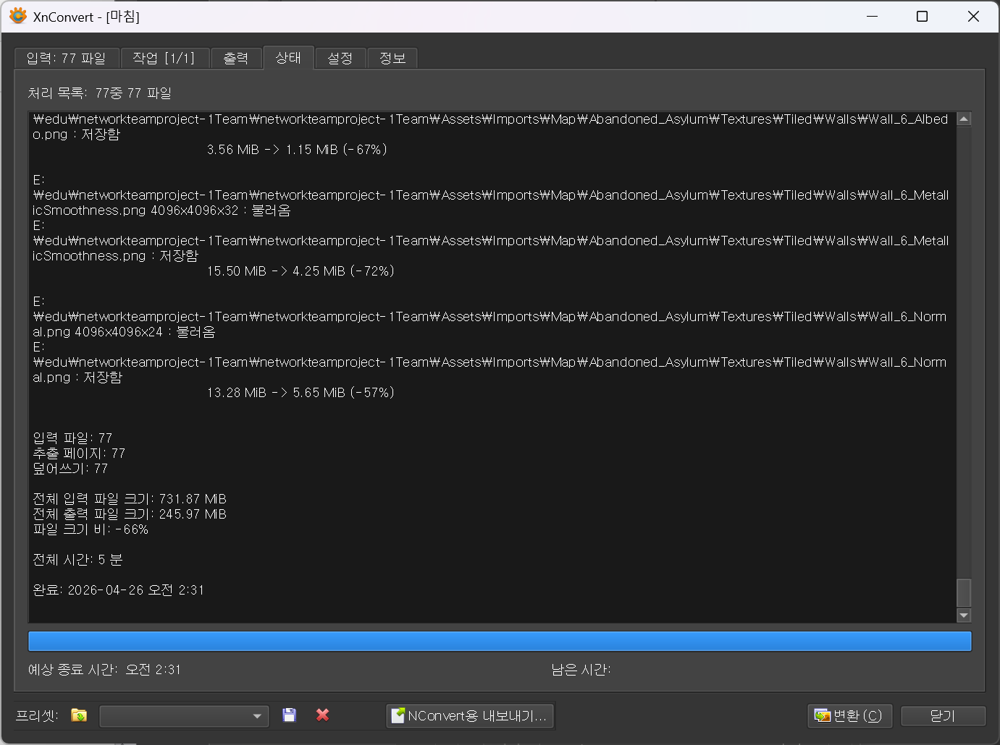

# 네트워크 팀프로젝트_작업 노트

**작성자**: 이성규  
**게임명**: 낯선 곳에 잡혀왔지만 괴물은 갇혀있으니 럭키비키\~\!★ (임시)  
**작성일**: 2026-04-24  
**최종 수정**: 2026-04-24  

## 프로젝트 개요

- **진행 기간**: 2026.04.24(금)~2026.05.18(목)
- **개발 환경**: Unity / C# / URP 3D / UGS + Relay
- **유니티 버전**: 6.3 LTS

# 작업 일지

## Day 1 — 2026-04-24

기초 프로젝트 세팅 및 팀 작업 방향 상담 및 회의


main 브랜치 Ruleset 생성으로 휴먼 이슈로 인한 main 브랜치 커밋이나 풀리퀘 체크 과정 추가.

가이드 문서, 역할 분담 문서 등 팀 문서 양식 작성.

## Day 2 — 2026-04-25

유니티 최적화 가이드 문서 작성  
프로젝트 에셋 파일 확인  
Project Auditor 패키지를 통한 프로젝트 파일 분석


라이트 베이킹은 에셋 자체에서 잘 설정되어 있어 별도 작업 없이 패스. 텍스쳐 목록을 확인하고 용량이 큰 순으로 해당 에셋이 적용되는 씬을 살펴보며 Max Size 조정.


VRWorldToolkit을 사용해 다시 텍스쳐를 상세히 확인하고 관리. 오리지널 사이즈보다 큰 MaxSize를 가진 텍스쳐의 MaxSize를 조정.  
`t:Texture`를 통해 전체 텍스쳐 사이즈 확인 완료.

> Unity의 Max Size는 임포트되는 GPU 메모리 / 빌드 크기에만 영향을 주고 원본 PNG 파일 자체는 그대로 남는다. 공유 패키지(Google Drive) 크기까지 줄이려면 원본 리사이즈가 별도로 필요.


실제 원본 용량 감소를 위해 `너비:>4000`을 에셋 임포트 폴더에 검색해 4000 사이즈 이상의 텍스쳐 이미지를 전부 선택 후 XnConvert를 통해 2048 사이즈로 변환해 덮어씌움 (스카이박스 제외 — 큐브맵 특성상 해상도 유지 필요).






수동으로 작업한 몇 개의 파일을 제외하고 77개의 파일 자동 변환 성공.

```
전체 입력 파일 크기: 731.87 MiB
전체 출력 파일 크기: 245.97 MiB
파일 크기 비: -66%
```

> Imports 폴더는 .gitignore 대상이라 Git 저장소엔 영향 없음. 다만 팀 공유 패키지(Google Drive) 크기가 줄어 신규 팀원 셋업 / 재다운로드 시 시간 단축 효과.

위 과정을 통해 3.05GB로 기존에 공유받은 Imports 폴더의 패키지 용랑을 3.05GB에서 2.32GB로 용량 감소 성공.

---
## 작업 일지 양식

## Day N — YYYY-MM-DD
