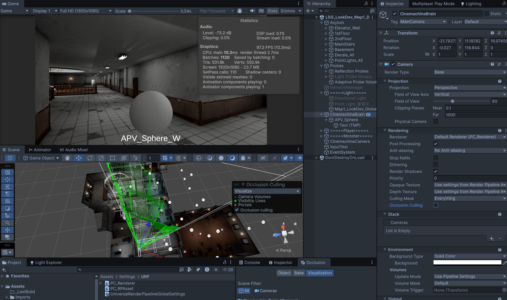
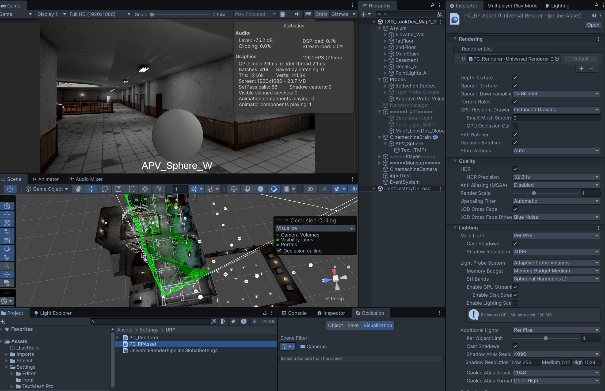
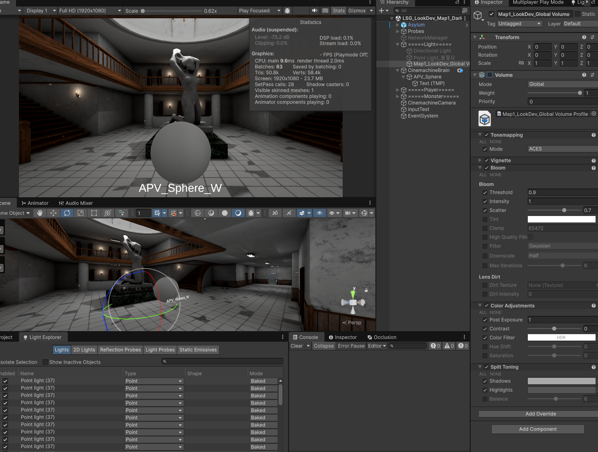
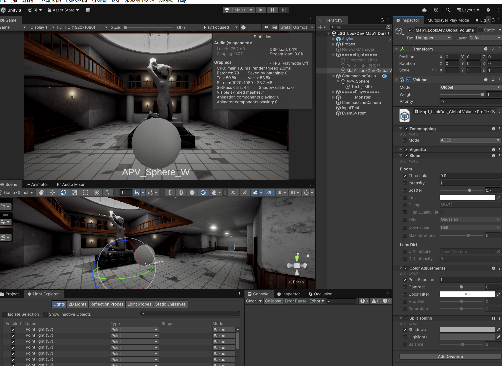

# 네트워크 팀프로젝트_작업 노트

**작성자**: 이성규  
**게임명**: 낯선 곳에 잡혀왔지만 괴물은 갇혀있으니 럭키비키\~\!★ (임시)  
**작성일**: 2026-04-24  
**최종 수정**: 2026-04-24  

## 프로젝트 개요

- **진행 기간**: 2026.04.24(금)~2026.05.18(목)
- **개발 환경**: Unity / C# / URP 3D / UGS + Relay
- **유니티 버전**: 6.3 LTS

# 작업 일지

## Day 1 — 2026-04-24

기초 프로젝트 세팅 및 팀 작업 방향 상담 및 회의


main 브랜치 Ruleset 생성으로 휴먼 이슈로 인한 main 브랜치 커밋이나 풀리퀘 체크 과정 추가.

가이드 문서, 역할 분담 문서 등 팀 문서 양식 작성.

## Day 2 — 2026-04-25

유니티 최적화 가이드 문서 작성  
프로젝트 에셋 파일 확인  
Project Auditor 패키지를 통한 프로젝트 파일 분석


라이트 베이킹은 에셋 자체에서 잘 설정되어 있어 별도 작업 없이 패스. 텍스쳐 목록을 확인하고 용량이 큰 순으로 해당 에셋이 적용되는 씬을 살펴보며 Max Size 조정.


VRWorldToolkit을 사용해 다시 텍스쳐를 상세히 확인하고 관리. 오리지널 사이즈보다 큰 MaxSize를 가진 텍스쳐의 MaxSize를 조정.  
`t:Texture`를 통해 전체 텍스쳐 사이즈 확인 완료.

> Unity의 Max Size는 임포트되는 GPU 메모리 / 빌드 크기에만 영향을 주고 원본 PNG 파일 자체는 그대로 남는다. 공유 패키지(Google Drive) 크기까지 줄이려면 원본 리사이즈가 별도로 필요.


실제 원본 용량 감소를 위해 `너비:>4000`을 에셋 임포트 폴더에 검색해 4000 사이즈 이상의 텍스쳐 이미지를 전부 선택 후 XnConvert를 통해 2048 사이즈로 변환해 덮어씌움 (스카이박스 제외 — 큐브맵 특성상 해상도 유지 필요).


수동으로 작업한 몇 개의 파일을 제외하고 77개의 파일 자동 변환 성공.

```
전체 입력 파일 크기: 731.87 MiB
전체 출력 파일 크기: 245.97 MiB
파일 크기 비: -66%
```

> Imports 폴더는 .gitignore 대상이라 Git 저장소엔 영향 없음. 다만 팀 공유 패키지(Google Drive) 크기가 줄어 신규 팀원 셋업 / 재다운로드 시 시간 단축 효과.

위 과정을 통해 3.05GB로 기존에 공유받은 Imports 폴더의 패키지 용랑을 3.05GB에서 2.32GB로 용량 감소 성공.

## Day 3 — 2026-04-26

룩뎁 샘플씬 작업 진행. 라이팅 / 컬링 / PPS 세 영역으로 나눠 진행했고, 동일 씬에서 Profiler·Stats로 실시간 검증.

### 라이팅 베이크 전략

씬 내 95개 라이트 중 대다수를 Baked로 전환하여 최적화 기반 마련. 호러 장르 특성상 정적 조명 비중이 압도적이라 Mixed보다 Baked 우선 전략이 효율적.

- 촛불 모델링의 그림자 외곽선 자연스러움을 위해 **Baked Shadow Radius** 값 조절
- 조명 Temperature **4000K** 적용 → 실내 화이트 밸런스 조정 (따뜻한 톤 ↔ 차가운 분위기 균형)
- 대량의 천장등을 Area Light로 전환하는 작업은 추후 여유 시간에 폴리싱으로 진행

### GI: APV 적용

작업 시간 효율을 고려해 **APV(Adaptive Probe Volumes)** 적용. 기존 Light Probe Group 수동 배치 대비 자동 분포 + 일관된 품질로 시간 절감.

### CPU 오클루전 컬링

| 항목 | 미적용 | 적용 | 변화 |
|------|--------|------|------|
| Batches (가장 배칭 많은 구간) | 1120 | 416 | **-63%** |




> **GPU 오클루전 컬링은 역효과** — 적용 시 배칭 및 다양한 수치가 2배가량 증가해 배제.  
> (CPU OC가 정적 환경에 더 적합한 결과로 보임. GPU OC는 동적 오브젝트가 많은 씬에서 효과적이라 이번 호러 씬과 매칭이 안 맞은 듯)

### Volume PPS 후처리




호러 톤 기본 프로파일 적용. 세부 항목은 룩뎁 가이드 별도 문서로 정리 예정.

### 다음

- Area Light 전환 (천장등) — 폴리싱 단계
- PPS 프로파일 세부 정리
- 메인 씬 적용 시 이식 가능한 자산화 (프리셋/프로파일 분리)

## Day 4 — 2026-04-27

오전 중 진행 방향 회의 진행 및 기존 설치 패키지 사용법 안내.

씬 복사 시 APV 베이킹 데이터 복사 안되는 문제 확인.
복사된 씬에서 **Baking Mode를 Baking Set으로 변경 후 Bake Probe Volumes 실행 시 정상 동작 확인.**


### 플레이어 제작
팀원의 네트워크 코어시스템 스크립트 베이스 동작 확인 후 작업 시작

#### 구조 설계 (사전 메모)

> 본격 플레이어 구현 전 사전 계획. 아직 실제 코드는 작성 전이며 본 문서에만 정리.

```
Assets/Project/Scripts/Player/
├ Core/
│  ├ PlayerController.cs           // 메인 조립자 (NetworkBehaviour)
│  ├ PlayerInputHandler.cs         // BattleInputReader 라우팅
│  └ DamageInfo.cs                 // 데미지 정보 struct
│
├ Movement/
│  ├ PlayerMovement.cs             // CharacterController.Move() 래퍼
│  └ PlayerCamera.cs               // 1인칭 + Cinemachine
│
├ Combat/
│  ├ PlayerCombat.cs               // 공격 입력 + ServerRpc
│  ├ PlayerHealth.cs               // HP NetworkVariable + IDamageable
│  └ PlayerCombatState.cs          // enum
│
├ Animation/
│  └ PlayerAnimation.cs            // Animator 파라미터 + Layer Weight
│
├ Interaction/
│  └ PlayerInteractor.cs           // IInteractor 구현
│
└ Interfaces/
   ├ IInteractor.cs
   ├ IInteractable.cs
   └ IDamageable.cs
```

draw.io를 통해 사전 구조 설계.
스크립트를 작성하기 앞서 시행착오를 줄이고 유지보수 및 협업에 편한 구조를 만들기 위함.


#### Fake Shadow (URP Decal Projector)

팀원이 테스트로 제작한 플레이어 동작 테스트 중, 그림자 렌더링 관련 연출을 URP Decal Projector로 처리하기로 결정.

씬 라이팅이 전부 Static Baked로 설정되어 있어 Realtime Directional Light로 그림자만 추가하기엔 비효율 + 베이크 톤과 충돌 우려. **페이크 그림자 데칼이 호러 톤 유지 + 비용 측면 모두 적합**하다고 판단.

**작업 내용**:
- 가짜 그림자용 텍스쳐(흑백 타원 페이드) 준비
- URP Decal 머티리얼 생성 (Shader Graphs/Decal)
- URP Decal Projector 컴포넌트를 플레이어 자식으로 배치
- 점프 시 자연스러운 연출을 위해 `FakeShadowFader` 스크립트 작성
  - 아래로 Ray → Ground 레이어 충돌 거리 측정
  - 설정한 최대 높이 비례로 `fadeFactor` 조절 → 점프 시 그림자가 옅어짐
- 정상 동작 확인

## Day 5 — 2026-04-28

- 프리팹 충돌 방지를 위해 개인별 네트워크 프리팹 리스트를 활용한 독립 작업 및 추후 병합으로 합의.
- 본격적인 플레이어 개발을 위한 폴더 생성 및 임시 개인 작업용 네트워크 프리팹 리스트 생성

## 플레이어 컨트롤러 제작 시작

어제 작업한 구조 설계를 기반으로 스크립트 생성

`PlayerController`는 캐싱 및 플레이어 모듈 간 의존성 주입을 담당하는 최상단 에이전트(NetworkBehaviour)
컴포넌트 선언후 캐싱, 네트워크 스폰시 다른 클라이언트의 입력 방지 및 오너만 모듈간 의존성 주입 허용

작업용 플레이어 프리팹 최상단에 붙임

다음으로 기초가 될 입력 처리 구현
`PlayerInputHandler`

---
## 작업 일지 양식

## Day N — YYYY-MM-DD
